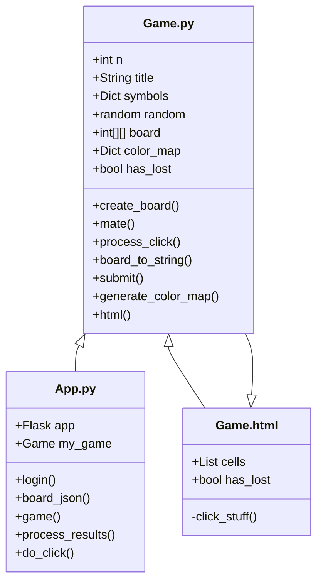
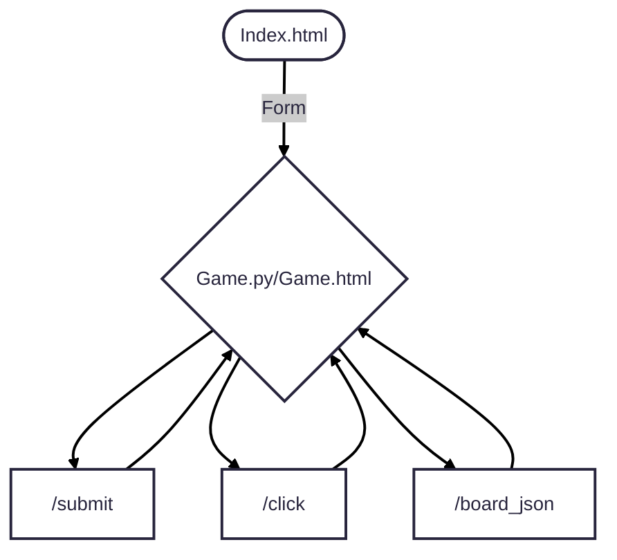

# AMPSweeper

Class Diagrams:

```mermaid
classDiagram
direction TB
    class App.py {
	    +Flask app
	    +Game my_game
	    +login()
	    +board_json()
	    +game()
	    +process_results()
	    +do_click()
    }

    class Game.py {
	    +int n
	    +String title
	    +Dict symbols
	    +random random
	    +int[][] board
	    +Dict color_map
	    +bool has_lost
	    +create_board()
	    +mate()
	    +process_click()
	    +board_to_string()
	    +submit()
	    +generate_color_map()
	    +html()
    }

    class Game.html {
	    +List cells
	    +bool has_lost
	    -click_stuff()
    }

    Game.py <|-- App.py
    Game.py <|-- Game.html
    Game.py --|> Game.html
```
State Machine:

```mermaid
---
config:
  theme: redux
---
flowchart TD
    A(["Index.html"]) -- Form --> B{"Game.py/Game.html"}
    B --> D["/submit"] & n1["/click"] & n2["/board_json"]
    n1 --> B
    D --> B
    n2 --> B
```
